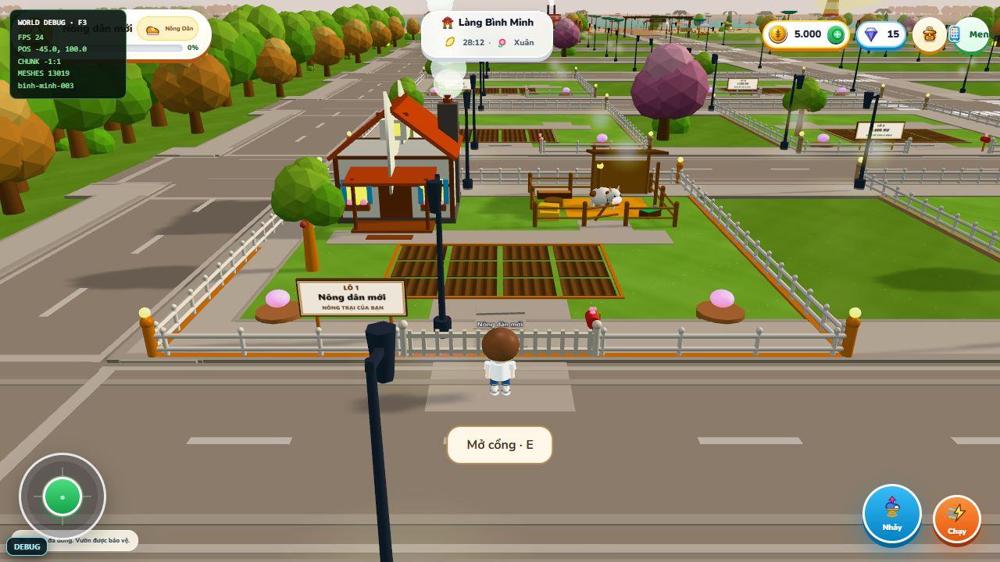

# Cổng nông trại và ăn trộm nông sản

## Sử dụng

- Chủ đất đứng cách giữa cổng tối đa 3m: bấm nút **Mở cổng / Đóng cổng**, phím **E**, hoặc bấm cánh cổng.
- Cổng mặc định đóng sau mua đất. Lô chưa bán vẫn mở để tham quan.
- Chỉ khi chủ để cổng mở, khách mới vào được qua lối cổng. Server chặn cả đường xuyên hàng rào và cổng đóng, không phụ thuộc độ cao nhảy.
- Khách trong vườn khi cổng đóng được đi ra qua lối cổng, nhưng không vào lại hoặc trộm tiếp. Không đóng khi người chơi đứng trong vùng quét cổng.
- Khách đứng sát cây chín, bấm cây hoặc E và đứng yên khoảng 3 giây. HUD hiện thanh tiến trình. Di chuyển hoặc đóng cổng hủy lượt. Đây là tương tác đứng yên, không yêu cầu giữ chuột liên tục.

## Quy tắc và cấu hình

Tất cả tham số tại `shared/farmConfig.js` → `security`.

- `gate`: trạng thái mặc định, thời gian animation, khoảng cách và quyền ra ngoài của khách.
- `theft`: bật/tắt, bắt buộc cổng mở, thời gian tương tác, khoảng cách, tối đa 3 lượt/tài khoản/ngày và 3 lượt/nông trại/ngày, bảo vệ nông trại mới 72 giờ.
- Ngày giới hạn tính theo UTC. Chỉnh cấu hình cần khởi động lại server và tải lại client.
- Một cây chỉ bị lấy một lần mỗi vụ. Chủ giữ ít nhất 75% sản lượng.
- Vụ mới ngoài hướng dẫn cho 4 sản phẩm, trộm lấy tối đa 1, chủ thu phần còn lại. Đây là thay đổi cân bằng kinh tế so với trước (1 sản phẩm/cây); giá hạt và giá bán hiện chưa đổi. Có thể đặt `normalYield: 1` để giữ cân bằng cũ và bảo vệ toàn bộ cây.
- Cây cũ không có trường sản lượng vẫn được coi là 1 sản phẩm, không bị lấy. Cây hướng dẫn được bảo vệ. Chưa có trộm vật nuôi, tiền hay đồ trong kho.

## Dữ liệu và tính nhất quán

`farm_assignments` lưu `gateOpen`, `gateUpdatedAt`, giới hạn ngày và 50 bản ghi gần nhất `theftLog`. Client bỏ qua bản đồng bộ cổng cũ hơn bản đã nhận. Model cổng nhận lại trạng thái khi chunk được tải lại.

Server kiểm tra vị trí trong vườn, khoảng cách, thời gian đứng yên, phiên lượt tương tác, độ chín, bảo vệ người mới, sức chứa kho và giới hạn. Client không gửi số lượng hoặc sản lượng làm nguồn xác nhận.

Hàng đợi theo nông trại tuần tự hóa cổng, canh tác và ăn trộm trong một server Node. Khoản chuyển đồ dùng claim bền vững trên cây và receipt trên người chơi, có phục hồi sau restart trên MongoDB standalone. Bản ghi giới hạn được hoàn tất theo receipt, không trả đồ hai lần. Triển khai nhiều tiến trình server cùng ghi cần thêm khóa phân tán/giao dịch; không coi hàng đợi trong bộ nhớ là khóa nhiều máy.

Thông báo trực tiếp gửi chủ đang online. Lịch sử đã được lưu server; chưa có màn hình nhật ký riêng hoặc thông báo offline trong HUD.

## Kiểm thử ngày 2026-10-04

- `npm run test:farm-security`: client visitor interaction, MongoDB thực và hai tài khoản WebSocket; cơ sở dữ liệu kiểm thử riêng, tự dọn sau test.
- Đạt: quyền chủ, cổng đóng/mở, chặn vượt rào, cho khách ra, đóng giữa lượt, di chuyển rồi quay lại, tranh cùng cây, kho đầy, phát lại yêu cầu, giới hạn ngày và phục hồi sau gián đoạn.
- `npm run test:land`, `npm run test:farm-config`, kiểm thử collision và startup imports đạt.
- Build xác nhận đủ 57 model và 288 lô đất. Cảnh báo bundle lớn vẫn còn, không phải lỗi build.
- Trình duyệt tại cổng lô 1: nút đổi đúng trạng thái, cánh cổng mở/đóng, không ghi nhận JavaScript error trong lượt kiểm tra. Không dùng kết quả này để khẳng định toàn thế giới đã hết giật lag.

Chạy dev bằng `npm run dev`. Nếu backend hiện tại không chạy watch, khởi động lại nó để nhận giao thức `farm_gate` và `theft_pending` mới. `VITE_MULTIPLAYER_URL` có thể trỏ client kiểm thử tới server riêng; mặc định vẫn dùng cổng 8787.
