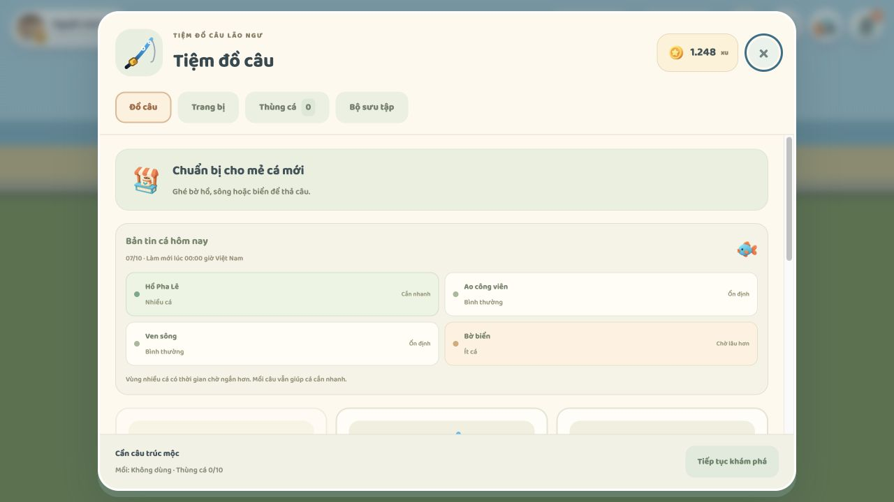
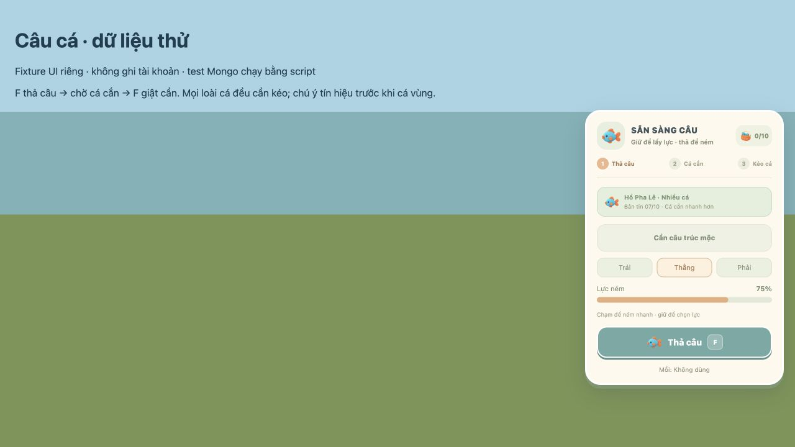
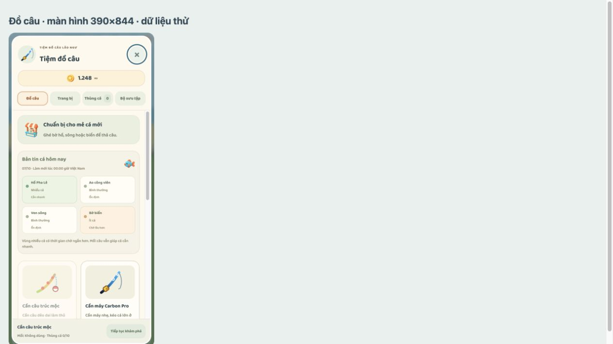

# Bản tin mật độ cá theo ngày

Server phân bố mỗi ngày một vùng nhiều cá, một vùng ít cá và hai vùng bình thường giữa hồ, ao, sông, biển. Ngày tính theo Việt Nam (UTC+7), đổi lúc 00:00. Phân bố được tính từ ngày nên tất cả người chơi/kênh và server khởi động lại nhận cùng kết quả.

Sau khi ném cần, thời gian cá tìm mồi ngẫu nhiên: nhiều cá 4–8 giây, bình thường 8–15 giây, ít cá 15–25 giây. Tiếp đó có 2 giây rỉa mồi: hai lần phao rung nhẹ, chưa cho phép giật cần. Mồi giảm phần chờ tìm mồi tối đa khoảng 31%, không rút ngắn động tác ném hoặc rỉa. Bóng cá chỉ xuất hiện lúc tiến gần mồi. Không thay đổi giá bán hoặc xác suất cá hiếm. Lượt câu lưu mật độ và ngày tại thời điểm thả, giữ nguyên khi qua nửa đêm.

Server gửi bản tin trong account_state và fishing_conditions khi vào kênh/đổi ngày. Client hiển thị dữ liệu server tại tiệm đồ câu và HUD vùng đang câu. Payload client không quyết định ngày hoặc mật độ.

## Kiểm tra

- `node scripts/test-fishing-conditions.mjs`: mốc nửa đêm Việt Nam, ổn định cả ngày/khởi động lại, phân bố 90 ngày, giới hạn mồi và animation, callback client khi đổi ngày.
- `node scripts/test-fishing-conditions-network.mjs`: hai người chơi nhận cùng bản tin qua server thật, account và broadcast; dùng MongoDB thử nghiệm riêng và dọn sau chạy.
- `node scripts/test-fishing-server.mjs`: thời gian cắn theo mật độ server, payload giả ngày/mật độ bị bỏ qua; vòng câu/bán/lưu không nhận thưởng trùng.
- Fishing session, mô phỏng kinh tế, App bindings và production build đạt.
- Giao diện desktop và iframe điện thoại 390×844 được kiểm tra bằng trình duyệt; dữ liệu UI thử không ghi tài khoản.

