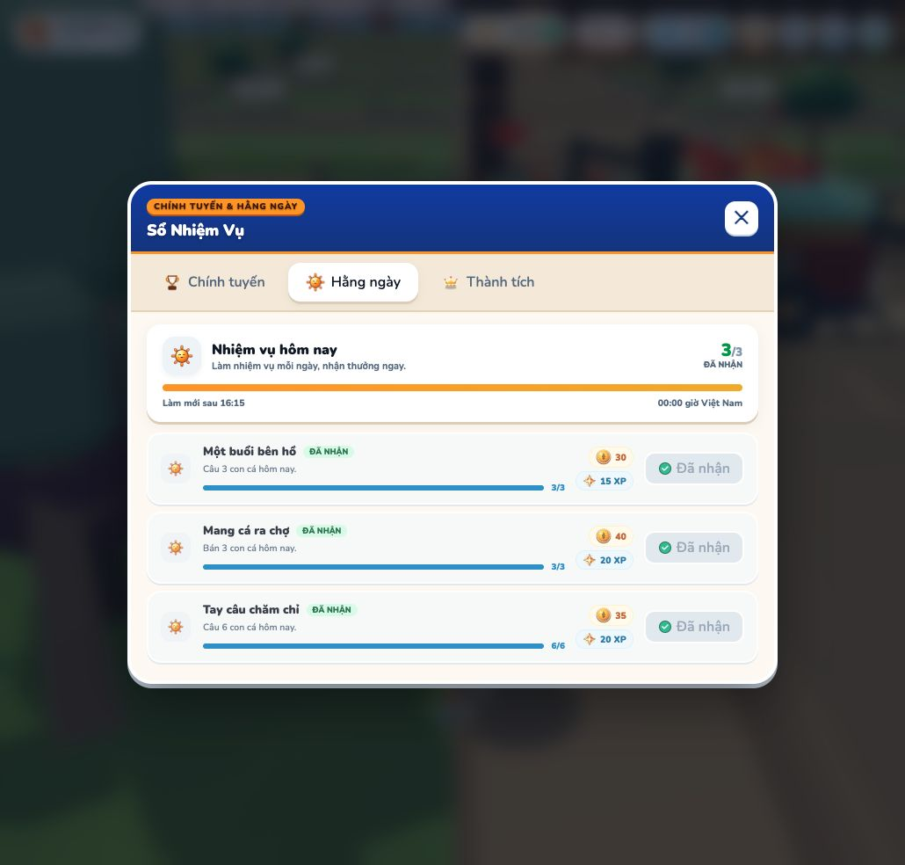

# UI journey verification — 2026-10-07

Test setup: Vite on localhost:4177 and an isolated server on port 8787, using MongoDB `farm_ui_journey_20261007`. Character: “Thử Nhiệm Vụ”. No production database reset or production server restart.

## Executed through the actual UI

- Created character, bought the 150-xu rod, reached the lake, caught one perch (0.52 kg, 17 xu), returned to the shop and sold it.
- Claimed all three pre-land daily rewards (105 xu / 55 XP); repeat claims disabled.
- Opened the land market, loaded 288 lots, filtered Làng Bình Minh and bought lot 1 for 10,950 xu. Wallet: 12,605 → 1,655.
- Received three free carrot seeds and 50 xu from Oliver. Wallet: 1,705.
- Opened the farm gate; reached the first unlocked cell; planted, watered and harvested a tutorial carrot. One free seed consumed; wallet unchanged. Inventory gained one carrot.
- Reached Oliver, opened the orders board and delivered the carrot: +65 xu / +40 XP. Inventory consumed the carrot; delivered order marked complete.
- Graduated: +200 xu / +80 XP and bicycle. Wallet: 1,970; XP: 191; level 2. Server record confirms onboarding completed and vehicles `walk`, `bike`.
- Main board shows five chapters / fifteen missions; first harvest mission shows 1/3 and later stages are locked.
- Daily board still shows the original three fishing missions, all claimed, after buying land and completing the tutorial. No second daily reward set is issued on graduation.

## Explicit fixtures and limits

After the first real fish sale, the isolated player's wallet was set to 12,500 and fishing counters were set to six caught / three sold, to exercise later UI without playing for two days. Daily claim buttons and land purchase remained actual UI actions. This verifies integration and reward accounting; it does **not** measure the real time needed to earn land. No later main-mission completion was fabricated for this UI run. Full claim sequencing, duplicate rejection, unlock milestones and migration are covered by the automated mission/server suites.

## Fixes found in the UI run

- Welcome prompt now points to fishing before land ownership.
- The land panel explicitly requests the market list; opening it no longer depends on a nearby farm appearing in the scene scope. Market-only packets do not erase visible farm data.
- Automatic walking finds collision-safe routes, flushes loaded scene obstacles and retries a blocked route up to three times. A bounded heap search avoids excessive work when the target is unreachable.
- Farm guidance and its marker point to unlocked cell `0:0` instead of a locked cell / parcel center.
- Oliver walking destinations stop 2.5 m in front of the kiosk, rather than inside its collider.
- Graduation text describes continued progression; it no longer promises every facility unlocks immediately.

## Evidence

## Checks

- `npm run test:land`: passed, including direct market request, purchase races, four starter cells, tutorial crop, order, graduation, duplicate rejection and reconnect/crash recovery.
- `npm run test:walking-path`: passed, including actual town colliders, first crop cell ↔ Oliver approach, gates and unreachable targets.
- `npm run test:pre-land-missions`: passed.
- `npm run test:mission-activities`: passed.
- Reload verification: wallet 1,970, XP 191, two free seeds, completed tutorial and bicycle retained. Daily board still 3/3 claimed. Chapter five shows actual plot counts 4/5, 4/8 and 4/12.
- `npm run test:missions`: passed, including authoritative server progress, sequence, concurrent claims and daily baselines.
- Additional broad collision check currently fails at its existing assertion for a town flowerbed at (-14, -14). `WorldCollisionSystem.js` is unchanged by this work; this separate scenery/collision mismatch remains outside the mission journey fixes. No claim is made that the full broad collision suite passes.
- Final `npm run build`: passed (asset/layout validation and road connectivity included); Vite retains its bundle-size warning.

## Follow-up — new-player pacing

The broad collision suite now passes. Its four flowerbed assertions referred to objects removed from the current plaza scene; the regression now checks that those positions stay walkable rather than adding invisible obstacles. Actual fountain, building, fence, shop entrance and world boundary checks remain in the suite.

The new linked simulation is documented in `../new-player-journey/report.md`. It preserves fishing XP and reward state across land purchase, rather than starting farming with a separately funded wallet.
